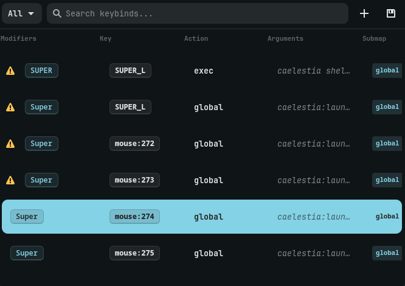

# hyprKCS

[](https://opensource.org/licenses/MIT)
[](https://aur.archlinux.org/packages/hyprkcs-git)
[](https://www.rust-lang.org/)
[](https://github.com/kosa12/hyprKCS)

A fast, lightweight, and graphical keybind manager for Hyprland, built with Rust and GTK4.

<p align="center">
  
  
  
</p>

<details>
  <summary align="center">View a Live Demo</summary>
  <p align="center">
    
  </p>
</details>

## Overview

hyprKCS provides a simple and intuitive interface to view, edit, and manage your Hyprland keybinds. It automatically parses your `hyprland.conf` (and any sourced files), detects conflicts, and allows you to make changes safely.

## Features

- **Native GTK4 Interface**: Integrates seamlessly with your system theme, supporting both light and dark modes via Libadwaita.
- **Real-time Fuzzy Search**: Instantly find keybinds as you type.
- **Category Filtering**: Filter binds by common categories like Workspace, Window, Media, or Custom scripts.
- **Conflict Detection**: Automatically identifies and highlights duplicate keybinds, resolving Hyprland variables (e.g., `$mainMod`) for accuracy.
- **Full Keybind Management**: Add, edit, and delete keybinds directly from the UI. Changes are written back to the correct configuration files.
- **Configuration Backup**: Create a timestamped backup of your configuration files with a single click.
- **Conflict Resolution Wizard**: A guided tool to help resolve duplicate keybinds one by one.

## Installation

### From AUR (Arch Linux)
```bash
yay -S hyprkcs-git
```

### From Nix
```bash
nix run github:kosa12/hyprKCS
```

### From Source
Ensure you have `rust`, `cargo`, and `gtk4` development headers installed.
```bash
git clone https://github.com/kosa12/hyprKCS.git
cd hyprKCS
cargo build --release
# The binary will be at ./target/release/hyprKCS
```

## Configuration

You can customize the appearance and behavior of hyprKCS by creating a configuration file at `~/.config/hyprkcs/hyprkcs.conf`. If a value is invalid or omitted, a default will be used.

**Example `hyprkcs.conf`:**
```ini
# Window dimensions
width = 1000px
height = 800px

# Appearance
opacity = 0.95
fontSize = 10pt
borderSize = 2px
borderRadius = 10px

# UI Elements
showSubmaps = true
showArgs = true

# Spacing
monitorMargin = 20px
rowPadding = 5px
```

| Option | Description | Default |
| --- | --- | --- |
| `width` | Window width (in pixels) | `700` |
| `height` | Window height (in pixels) | `500` |
| `opacity` | Window background opacity (0.0 to 1.0) | `1.0` |
| `fontSize` | Global font size (e.g., `10pt`, `1rem`) | `0.9rem` |
| `borderSize` | Global border thickness | `1px` |
| `borderRadius` | Main window corner radius | `12px` |
| `showSubmaps` | Toggles visibility of the "Submap" column | `true` |
| `showArgs` | Toggles visibility of the "Arguments" column | `true` |
| `monitorMargin` | Margin around the window (in pixels) | `12` |
| `rowPadding` | Vertical padding between list rows (in pixels) | `2` |

## Usage

### Graphical Interface

Launch `hyprKCS` from your application menu or terminal to open the main window.

**Keyboard Shortcuts**
| Key | Action |
| --- | --- |
| `/` | Focus the search bar |
| `Enter` | Edit the selected keybind |
| `Ctrl` + `f` | Focus the search bar |
| `Esc` | Clear search or close the window |

### Command-Line Interface

hyprKCS also includes a powerful CLI for quick lookups and scripting.

- **Print all keybinds:**
  ```bash
  hyprKCS --print
  # Short: hyprKCS -p
  ```
- **Search for a keybind:**
  ```bash
  hyprKCS --search "firefox"
  # Short: hyprKCS -s "firefox"
  ```
- **Use a custom config file:**
  ```bash
  hyprKCS --config ~/.config/hypr/custom.conf
  # Short: hyprKCS -c ~/.config/hypr/custom.conf
  ```

## Project Status

**Completed Features:**
- CLI for searching and printing keybinds.
- Fuzzy search and category filtering in the UI.
- Conflict detection and an interactive resolution wizard.
- Smart autocomplete for Hyprland dispatchers.

**Planned Features:**
- Pinned or "favorite" keybinds.
- A visual statistics dashboard for keybind analysis.

## Troubleshooting

### GPG Key Import Issues
If you encounter errors like `gpg: keyserver receive failed` when installing from the AUR, you may need to import the required PGP key manually.

Try importing from the Ubuntu keyserver:
```bash
gpg --keyserver keyserver.ubuntu.com --recv-keys D2059131FDE2EECC7C90A549F2CB939C8AA67892
```

Or from OpenPGP:
```bash
gpg --keyserver keys.openpgp.org --recv-keys D2059131FDE2EECC7C90A549F2CB939C8AA67892
```

## Contributing

Contributions are welcome. Please see [CONTRIBUTING.md](CONTRIBUTING.md) for guidelines.

## License

This project is licensed under the MIT License. See the [LICENSE](LICENSE) file for details.
