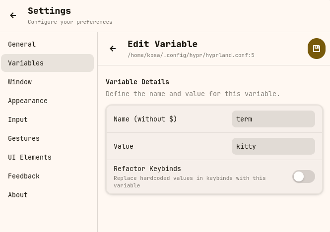
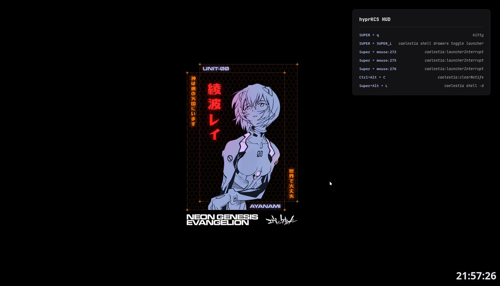

# hyprKCS

[](https://www.gnu.org/licenses/gpl-3.0)
[](https://aur.archlinux.org/packages/hyprkcs-git)
[](https://crates.io/crates/hyprKCS)
[](https://github.com/kosa12/hyprKCS/actions/workflows/cargo-build.yml)
[](https://www.rust-lang.org/)


A fast, lightweight, and graphical keybind manager for Hyprland, built with Rust and GTK4.

<p align="center">
  
  
  
</p>

<details>
  <summary align="center">View a Live Demo</summary>
  <p align="center">
    
  </p>
</details>

## Overview

hyprKCS provides a simple and intuitive interface to view, edit, and manage your Hyprland keybinds. It automatically parses your `hyprland.conf` (and any sourced files), detects conflicts, and allows you to make changes safely.

## Features

- **Native GTK4 Interface**: Integrates seamlessly with your system theme, supporting both light and dark modes via Libadwaita.
- **Real-time Fuzzy Search**: Instantly find keybinds as you type.
- **Advanced Search Syntax**: Use tags like `mod:`, `key:`, `action:`, or `desc:` to filter keybinds with precision.
- **Visual Keyboard Map**: Interactive layout to visualize used and available keys for any modifier combination. Supports multiple physical layouts including ANSI, ISO, JIS, ABNT2, or Hungarian.
- **Category Filtering**: Filter binds by common categories like Workspace, Window, Media, or Custom scripts.
- **Conflict Detection**: Automatically identifies and highlights duplicate keybinds, resolving Hyprland variables for accuracy.
- **Broken Bind Detection**: Automatically validates `exec` and `execr` commands, flagging keybinds that point to missing executables or scripts with a red exclamation mark.
- **Bind Flags Support**: Full support for Hyprland's specialized bind flags like `binde` (repeat), `bindl` (locked), `bindr` (release), and more, selectable via a dropdown in the editor.
- **Bindd (Descriptions) Support for Omarchy Users**: Full support for the `bindd` format (`bindd = MODS, KEY, DESC, DISPATCHER, ARGS`). This allows you to store human-readable descriptions directly in the keybind line, making them compatible with interactive viewers like **Omarchy**.
- **Mouse Button & Scroll Support**: Easily bind actions to mouse buttons (Left/Right/Middle/Side), scroll wheel events, and dragging actions (`bindm`) using a dedicated UI mode.
- **Full Keybind Management**: Add, edit, and delete keybinds directly from the UI. Changes are written back to the correct configuration files.
- **Variable Management**: Define and manage Hyprland variables (e.g., `$mainMod`). Supports creating, editing, and deleting variables with smart reference handling and automatic refactoring.
- **Configuration Backup**: Create a timestamped backup of your configuration files with a single click or set the automatic backup behavior in the settings (it's set to true by default).
- **Interactive Restore**: Easily browse previous backups and restore your entire configuration tree with a single click.
- **Visual Diffs**: Compare any backup with your current configuration using a Git-style color-coded diff view before restoring.
- **Conflict Resolution Wizard**: A guided tool to help resolve duplicate keybinds one by one.
- **Bulk Replace**: Find and replace modifiers, keys, or commands across multiple keybinds at once, with a live case-insensitive preview.
- **Smart Autocomplete**: Suggests valid Hyprland dispatchers as you type.
- **Macro Builder (Chain Actions)**: Visually create complex keybinds that execute multiple dispatchers in sequence (e.g., move window AND switch workspace).
- **hyprKCS HUD (Wallpaper Overlay)**: A lightweight, unmovable, and transparent overlay that displays your selected keybinds directly on your wallpaper. It runs as a separate process and stays active even when the main application is closed.
- **Favorites**: Pin frequently used keybinds for quick access.
- **Input Device Configuration**: Manage your `input { ... }` block (layout, sensitivity, repeat rate) directly from the settings.
- **Settings Editor**: Configure UI, backup behavior, and appearance directly within the app.
- **Automatic Backups**: Automatically backup your configuration on every change, with optional retention limits.
- **Command-Line Interface**: Quickly search and print keybinds from the terminal.
- **Gesture Configuration (Hyprland v0.51+)**: Dedicated interface to configure workspace swipe gestures using the new `gesture = ...` syntax, replacing the deprecated `gestures { ... }` block.
- **Keybind Exporting**: Export your keybinds to a simple markdown file for easy sharing or documentation.

## Installation

### From AUR (Arch Linux)
```bash
yay -S hyprkcs-git
```

### From Crates.io
```bash
cargo install hyprKCS
```

### From Nix
```bash
nix run github:kosa12/hyprKCS
```

### From Source
Ensure you have `rust`, `cargo`, and `gtk4` development headers installed.

**Using Make (Recommended):**
```bash
git clone --depth=1 https://github.com/kosa12/hyprKCS.git
cd hyprKCS
make
sudo make install
```

**Using Cargo directly:**
```bash
git clone --depth=1 https://github.com/kosa12/hyprKCS.git
cd hyprKCS
cargo build --release
# The binary will be at ./target/release/hyprkcs
```

## Configuration

You can customize the appearance and behavior of hyprKCS by creating a configuration file at `~/.config/hyprkcs/hyprkcs.conf`. If a value is invalid or omitted, a default will be used.

| Option | Description | Default |
| --- | --- | --- |
| `width` | Window width (in pixels) | `700` |
| `height` | Window height (in pixels) | `500` |
| `opacity` | Window background opacity (0.0 to 1.0) | `1.0` |
| `fontSize` | Global font size (e.g., `10pt`, `1rem`) | `0.9rem` |
| `borderSize` | Global border thickness | `1px` |
| `borderRadius` | Main window corner radius | `12px` |
| `showSubmaps` | Toggles visibility of the "Submap" column | `false` |
| `showArgs` | Toggles visibility of the "Arguments" column | `true` |
| `showFavorites` | Toggles visibility of the "Favorites" column and category | `true` |
| `alternatingRowColors` | Toggles striped rows for the list view | `true` |
| `defaultSort` | Initial sort column (`key`, `dispatcher`, `mods`, etc.) | `key` |
| `keyboardLayout` | Physical keyboard layout for the visualizer (`ANSI`, `ISO`, `JIS`, `ABNT2`, `HU`) | `ANSI` |
| `shadowSize` | CSS box-shadow property for the window (`none` to disable) | `0 4px 24px rgba(0,0,0,0.4)` |
| `monitorMargin` | Margin around the window (in pixels) | `12` |
| `rowPadding` | Vertical padding between list rows (in pixels) | `2` |
| `autoBackup` | Automatically backup config on save | `true` |
| `maxBackupsEnabled` | Enable limiting the number of backups | `false` |
| `maxBackupsCount` | Maximum number of backups to keep | `10` |
| `showDescription` | Toggles visibility of the "Description" column (parsed comments from config files) | `false` |
<details>
<summary>Example Configuration</summary>

```ini
# Window dimensions
width = 1000px
height = 800px

# Appearance
opacity = 0.95
fontSize = 10pt
borderSize = 2px
borderRadius = 10px
alternatingRowColors = true
shadowSize = 0 4px 24px rgba(0,0,0,0.4)

# UI Elements
showSubmaps = false
showArgs = true
showFavorites = true
defaultSort = mods
keyboardLayout = ANSI
showDescription = true

# Behavior
autoBackup = true
maxBackupsEnabled = true
maxBackupsCount = 20

# Spacing
monitorMargin = 20px
rowPadding = 5px
```
</details>

## Usage

### Graphical Interface

Launch `hyprkcs` from your application menu or terminal to open the main window.

**Keyboard Shortcuts**
| Key | Action |
| --- | --- |
| `/` | Focus the search bar |
| `Enter` | Edit the selected keybind |
| `Ctrl` + `f` | Focus the search bar |
| `Esc` | Clear search or close the window |

**Advanced Search Syntax**
The search bar supports specific tags to filter results:
- `mod:<value>` / `mods:<value>`: Filter by modifiers (e.g., `mod:super`).
- `key:<value>`: Filter by key (e.g., `key:return`).
- `action:<value>` / `disp:<value>`: Filter by dispatcher/action (e.g., `action:exec`).
- `arg:<value>`: Filter by arguments (e.g., `arg:volume`).
- `desc:<value>`: Filter by description (e.g., `desc:screenshot`).

*Example:* `mod:super action:exec firefox` finds all Super-bound execution commands for Firefox.

**Bindd (Omarchy Support)**
Hyprland supports the `bindd` format which includes a human-readable description directly in the keybinding declaration. This is highly recommended for users of **Omarchy** or other interactive keybinding viewers.
1. When adding or editing a keybind, select **Description (bindd)** from the **Behavior (Flags)** dropdown.
2. Enter your description in the **Description** field.
3. hyprKCS will automatically format the line as `bindd = MODS, KEY, Description, DISPATCHER, ARGS`.
4. If you switch back to a standard flag (like `bind`), hyprKCS will move the description to a trailing comment (`# Description`) to preserve it.

**Visual Keyboard Map**
Click the keyboard icon in the top toolbar to open an interactive keyboard layout.
- **Select Modifiers**: Toggle SUPER, SHIFT, CTRL, or ALT to see which keys are bound to those modifiers.
- **Color Coding**: Keys bound to actions are highlighted. Hover over them to see the exact dispatcher and arguments.
- **Find Free Keys**: Easily spot unhighlighted keys to find available shortcuts for your configuration.
- **Multiple Layouts**: Switch between ANSI, ISO, JIS, ABNT2, or Hungarian layouts in the Settings to match your physical hardware.

<p align="center">
    
</p>

**Input Configuration**
Manage your system's input behavior without manual text editing.
- **Keyboard Settings**: Set your layout code, variant, options (XKB), repeat rate, and delay.
- **Mouse/Touchpad**: Adjust mouse sensitivity (-1.0 to 1.0) and window focus behavior (Follow Mouse).
- **Direct Save**: Changes are written directly to your `hyprland.conf` input block.

**Variable Management**
Organize your configuration using variables to keep it clean and maintainable.
- **Dynamic Listing**: View all variables defined across your configuration files, including their values and source locations.
- **Refactor Hardcoded Values**: When creating a new variable, hyprKCS can scan your keybinds and automatically replace hardcoded values (like `SUPER`) with the new variable (like `$mainMod`).
- **Safe Deletion**: Deleting a variable prompts you to "inline" its value, replacing all occurrences with the literal value so your keybinds remain functional.
- **Automatic Renaming**: Renaming a variable automatically updates all its references throughout your configuration.

<p align="center">
    
</p>

**Macro Builder**
Create complex multi-step actions without writing scripts.
1. Click the "Add Keybind" button.
2. Enable **Macro mode** using the macro toggle/switch in the keybind editor.
3. Use the visual builder to add steps (e.g., Step 1: `exec` -> `grim`, Step 2: `exec` -> `notify-send "Screenshot taken"`).
4. hyprKCS automatically formats this into a Hyprland-compatible macro command using `bash` and `hyprctl` (e.g., `bind = ..., exec, bash -c "hyprctl dispatch exec grim; hyprctl dispatch exec 'notify-send \"Screenshot taken\"'"`).

**hyprKCS HUD (Wallpaper Overlay)**
Keep your most important keybinds always in sight without opening the app.
- **Dedicated Overlay**: The HUD is a minimalist, transparent widget that sits on your wallpaper (Layer Background).
- **Persistent**: Since it runs as a separate process (`hyprkcs --hud`), it stays on your screen even after you close the main manager.
- **Easy Selection**: In **Settings > Wallpaper HUD**, you can search and toggle exactly which keybinds should appear on the overlay.
- **Non-Intrusive**: It is unmovable (but you can set it to be in top-right, top-left, bottom-right, or bottom-left positions) and doesn't catch input, ensuring it never interferes with your workflow. 

<p align="center">
    
</p>


**Bulk Replace**
Quickly update multiple keybinds at once (e.g., swapping `SUPER` for `ALT` or changing your terminal emulator).
1. Click the "Bulk Replace" icon in the top toolbar.
2. Select the target field (Modifiers, Key, Dispatcher, or Arguments).
3. Enter the text to find and the replacement text. The search is case-insensitive.
4. Review the matches in the "Preview" list. Hover over any item to see the full keybind definition.
5. Click "Apply Changes" to update all matches. A backup is automatically created before applying.

**Backup and Restore**
Safely manage your configuration versions.
- **Full Tree Backup**: Backs up your entire `~/.config/hypr` directory recursively, preserving folder structures and external scripts.
- **Interactive Restore**: Access the Restore menu from Settings to see all available timestamped backups.
- **Visual Diffs**: Before restoring, click "View Diff" to see a color-coded comparison (additions/removals) between the backup and your current files.
- **One-Click Recovery**: Restore your entire setup instantly if a change breaks your workflow.

### Command-Line Interface

hyprKCS also includes a CLI for quick lookups and scripting.

- **Print all keybinds:**
  ```bash
  hyprkcs --print
  # Short: hyprkcs -p
  ```
- **Search for a keybind:**
  ```bash
  hyprkcs --search "firefox"
  # Short: hyprkcs -s "firefox"
  ```
- **Advanced search via CLI:**
  ```bash
  hyprkcs --search "mod:super action:exec"
  ```
- **Use a custom config file:**
  ```bash
  hyprkcs --config ~/.config/hypr/custom.conf
  # Short: hyprkcs -c ~/.config/hypr/custom.conf
  ```
- **Launch the Wallpaper HUD:**
  ```bash
  hyprkcs --hud
  ```
- **System Check:**
  Check your system environment for compatibility issues:
  ```bash
  hyprkcs --doctor
  ```

## Troubleshooting

### System Compatibility Check
If the application fails to start or keybinds aren't saving, run the doctor command to diagnose your environment:
```bash
hyprkcs --doctor
```
This tool verifies:
- **Config Access**: Checks if `hyprland.conf` is found and writable.
- **Dependencies**: Confirms GTK4/Libadwaita runtime versions.
- **Hyprland IPC**: Ensures `hyprctl` can communicate with the compositor.
- **Input Devices**: Lists detected keyboards and guesses physical layout (ANSI/ISO).
- **Backups**: Verifies backup directory permissions.

### AUR Installation Issues (yay)
If you encounter errors during installation via `yay` (such as "cannot stat" or build failures after a package update), it may be due to a stale cache. Try clearing the cache and installing again:
```bash
rm -rf ~/.cache/yay/hyprkcs-git
yay -S hyprkcs-git
```

### GPG Key Import Issues
If you encounter errors like `gpg: keyserver receive failed` when installing from the AUR, you may need to import the required PGP key manually.

Try importing from the Ubuntu keyserver:
```bash
gpg --keyserver keyserver.ubuntu.com --recv-keys D2059131FDE2EECC7C90A549F2CB939C8AA67892
```

Or from OpenPGP:
```bash
gpg --keyserver keys.openpgp.org --recv-keys D2059131FDE2EECC7C90A549F2CB939C8AA67892
```

## Contributing

Contributions are welcome. Please see [CONTRIBUTING.md](CONTRIBUTING.md) for guidelines.

## License


This project is licensed under the GNU General Public License v3.0. See the [LICENSE](LICENSE) file for details.
