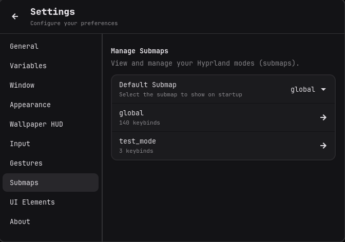

<h1 align="center">hyprKCS</h1>

<p align="center">
  <a href="https://www.gnu.org/licenses/gpl-3.0"></a>
  <a href="https://aur.archlinux.org/packages/hyprkcs-git"></a>
  <a href="https://crates.io/crates/hyprKCS"></a>
  <a href="https://github.com/kosa12/hyprKCS/actions/workflows/cargo-build.yml"></a>
  <a href="https://www.rust-lang.org/"></a>
  <a href="https://crates.io/crates/hyprKCS"></a>
</p>

<p align="center">
  A fast, lightweight, and graphical keybind manager for Hyprland, built with Rust and GTK4.
</p>

<p align="center">
  
</p>

<p align="center">
  <a href="#installation"></a>
  <a href="#usage"></a>
  <a href="#troubleshooting"></a>
</p>

## Overview

hyprKCS provides a simple and intuitive interface to view, edit, and manage your Hyprland keybinds. It automatically parses your `hyprland.conf` (and any sourced files), detects conflicts, and allows you to make changes safely.

<details>
  <summary align="center">View a Live Demo</summary>
  <p align="center">
    
  </p>
</details>

## Features

- **Native GTK4 Interface**: Integrates seamlessly with your system theme, supporting both light and dark modes via Libadwaita.
- **Real-time Fuzzy Search**: Instantly find keybinds as you type.
- **Advanced Search Syntax**: Use tags like `mod:`, `key:`, `action:`, or `desc:` to filter keybinds with precision.
- **Visual Keyboard Map**: Interactive layout to visualize used and available keys for any modifier combination. Supports multiple physical layouts including ANSI, ISO, JIS, ABNT2, or Hungarian.
- **Category Filtering**: Filter binds by common categories like Workspace, Window, Media, or Custom scripts.
- **Conflict Detection**: Automatically identifies and highlights duplicate keybinds, resolving Hyprland variables for accuracy.
- **Broken Bind Detection**: Automatically validates `exec` and `execr` commands, flagging keybinds that point to missing executables or scripts with a red exclamation mark.
- **Bind Flags Support**: Full support for Hyprland's specialized bind flags like `binde` (repeat), `bindl` (locked), `bindr` (release), and more, selectable via a dropdown in the editor.
- **Bindd (Descriptions) Support for Omarchy Users**: Full support for the `bindd` format (`bindd = MODS, KEY, DESC, DISPATCHER, ARGS`). This allows you to store human-readable descriptions directly in the keybind line, making them compatible with interactive viewers like **Omarchy**.
- **Mouse Button & Scroll Support**: Effortlessly bind actions to any mouse button, including Side and Extra buttons (8/9). hyprKCS automatically handles Hyprland submaps during recording to ensure global binds don't interfere with your selection.
- **Submap (Mode) Management**: Full visibility and management of Hyprland submaps. Create new submaps using the intuitive wizard, filter keybinds by submap, see how many binds each mode contains, and set a default submap to show on startup.
- **Full Keybind Management**: Add, edit, and delete keybinds directly from the UI. Changes are written back to the correct configuration files.
- **Variable Management**: Define and manage Hyprland variables (e.g., `$mainMod`). Supports creating, editing, and deleting variables with smart reference handling and automatic refactoring.
- **Configuration Backup**: Create a timestamped backup of your configuration files with a single click or set the automatic backup behavior in the settings (it's set to true by default).
- **Interactive Restore**: Easily browse previous backups and restore your entire configuration tree with a single click.
- **Visual Diffs**: Compare any backup with your current configuration using a Git-style color-coded diff view before restoring.
- **Conflict Resolution Wizard**: A guided tool to help resolve duplicate keybinds one by one.
- **Bulk Replace**: Find and replace modifiers, keys, or commands across multiple keybinds at once, with a live case-insensitive preview.
- **Smart Autocomplete**: Suggests valid Hyprland dispatchers as you type.
- **Macro Builder (Chain Actions)**: Visually create complex keybinds that execute multiple dispatchers in sequence (e.g., move window AND switch workspace).
- **hyprKCS HUD (Wallpaper Overlay)**: A lightweight, unmovable, and transparent overlay that displays your selected keybinds directly on your wallpaper. It runs as a separate process and stays active even when the main application is closed.
- **Favorites**: Pin frequently used keybinds for quick access.
- **Input Device Configuration**: Manage your `input { ... }` block (layout, sensitivity, repeat rate) directly from the settings.
- **Settings Editor**: Configure UI, backup behavior, and appearance directly within the app.
- **Automatic Backups**: Automatically backup your configuration on every change, with optional retention limits.
- **Command-Line Interface**: Quickly search and print keybinds from the terminal.
- **Gesture Configuration (Hyprland v0.51+)**: Dedicated interface to configure workspace swipe gestures using the new `gesture = ...` syntax, replacing the deprecated `gestures { ... }` block.
- **Keybind Exporting**: Export your keybinds to a simple markdown file for easy sharing or documentation.

## Compatibility

- **Hyprland**: Version v0.40.0 or newer is required for most features.
  - *Note*: **Gesture Configuration** requires v0.51.0+ due to the configuration syntax changes.
- **GTK**: Version 4.10+ is recommended for the best experience and performance.
- **Libadwaita**: Version 1.4+ is required for advanced UI elements.

## Installation

> [!NOTE]
> You need a functioning Hyprland installation.

### From AUR (Arch Linux)
```bash
yay -S hyprkcs-git
```

### From Crates.io
```bash
cargo install hyprKCS
```

### From Nix
```bash
nix run github:kosa12/hyprKCS
```

### From Source
> Ensure you have `rust`, `cargo`, and `gtk4` development headers installed.

**Using Make (Recommended):**
```bash
git clone --depth=1 https://github.com/kosa12/hyprKCS.git
cd hyprKCS
make
sudo make install
```

**Using Cargo directly:**
```bash
git clone --depth=1 https://github.com/kosa12/hyprKCS.git
cd hyprKCS
cargo build --release
# The binary will be at ./target/release/hyprkcs
```

## Usage

### Graphical Interface

Launch `hyprkcs` from your application menu or terminal to open the main window.

**Keyboard Shortcuts**
| Key | Action |
| --- | --- |
| `/` | Focus the search bar |
| `Enter` | Edit the selected keybind |
| `Ctrl` + `f` | Focus the search bar |
| `Esc` | Clear search or close the window |

**Advanced Search Syntax**

The search bar supports specific tags to filter results:
- `mod:<value>` / `mods:<value>`: Filter by modifiers (e.g., `mod:super`).
- `key:<value>`: Filter by key (e.g., `key:return`).
- `action:<value>` / `disp:<value>`: Filter by dispatcher/action (e.g., `action:exec`).
- `arg:<value>`: Filter by arguments (e.g., `arg:volume`).
- `desc:<value>`: Filter by description (e.g., `desc:screenshot`).

> *Example:* `mod:super action:exec firefox` finds all Super-bound execution commands for Firefox.

**Bindd (Omarchy Support)**

Hyprland supports the `bindd` format which includes a human-readable description directly in the keybinding declaration. This is highly recommended for users of **Omarchy** or other interactive keybinding viewers.
1. When adding or editing a keybind, select **Description (bindd)** from the **Behavior (Flags)** dropdown.
2. Enter your description in the **Description** field.
3. hyprKCS will automatically format the line as `bindd = MODS, KEY, Description, DISPATCHER, ARGS`.
4. If you switch back to a standard flag (like `bind`), hyprKCS will move the description to a trailing comment (`# Description`) to preserve it.

**Visual Keyboard Map**

Click the keyboard icon in the top toolbar to open an interactive keyboard layout.
- **Select Modifiers**: Toggle SUPER, SHIFT, CTRL, or ALT to see which keys are bound to those modifiers.
- **Color Coding**: Keys bound to actions are highlighted. Hover over them to see the exact dispatcher and arguments.
- **Find Free Keys**: Easily spot unhighlighted keys to find available shortcuts for your configuration.
- **Multiple Layouts**: Switch between ANSI, ISO, JIS, ABNT2, or Hungarian layouts in the Settings to match your physical hardware.

<p align="center">
    
</p>

**Input Configuration**

Manage your system's input behavior without manual text editing.
- **Keyboard Settings**: Set your layout code, variant, options (XKB), repeat rate, and delay.
- **Mouse/Touchpad**: Adjust mouse sensitivity (-1.0 to 1.0) and window focus behavior (Follow Mouse).
- **Direct Save**: Changes are written directly to your `hyprland.conf` input block.

**Variable Management**

Organize your configuration using variables to keep it clean and maintainable.
- **Dynamic Listing**: View all variables defined across your configuration files, including their values and source locations.
- **Refactor Hardcoded Values**: When creating a new variable, hyprKCS can scan your keybinds and automatically replace hardcoded values (like `SUPER`) with the new variable (like `$mainMod`).
- **Safe Deletion**: Deleting a variable prompts you to "inline" its value, replacing all occurrences with the literal value so your keybinds remain functional.
- **Automatic Renaming**: Renaming a variable automatically updates all its references throughout your configuration.

<p align="center">
    
</p>

**Submap Management**

Organize and navigate complex configurations using Hyprland's submap (mode) system.
- **Dedicated Submaps Page**: Access **Settings > Submaps** to see a list of all modes defined in your configuration.
- **Bind Count**: Quickly see how many keybinds are assigned to each submap.
- **Quick Navigation**: Click on any submap in the settings page to immediately filter the main view to show only those keybinds.
- **Default View**: Set a specific submap to be shown by default when hyprKCS starts, or keep it on "All Submaps" for a global view.

<p align="center">
    
</p>

**Macro Builder**

Create complex multi-step actions without writing scripts.
1. Click the "Add Keybind" button.
2. Enable **Macro mode** using the macro toggle/switch in the keybind editor.
3. Use the visual builder to add steps (e.g., Step 1: `exec` -> `grim`, Step 2: `exec` -> `notify-send "Screenshot taken"`).
4. hyprKCS automatically formats this into a Hyprland-compatible macro command using `bash` and `hyprctl` (e.g., `bind = ..., exec, bash -c "hyprctl dispatch exec grim; hyprctl dispatch exec 'notify-send \"Screenshot taken\"'"`).

**hyprKCS HUD (Wallpaper Overlay)**

Keep your most important keybinds always in sight without opening the app.
- **Dedicated Overlay**: The HUD is a minimalist, transparent widget that sits on your wallpaper (Layer Background).
- **Persistent**: Since it runs as a separate process (`hyprkcs --hud`), it stays on your screen even after you close the main manager.
- **Easy Selection**: In **Settings > Wallpaper HUD**, you can search and toggle exactly which keybinds should appear on the overlay.
- **Non-Intrusive**: It is unmovable (but you can set it to be in top-right, top-left, bottom-right, or bottom-left positions) and doesn't catch input, ensuring it never interferes with your workflow. 

<p align="center">
    
</p>


**Bulk Replace**

Quickly update multiple keybinds at once (e.g., swapping `SUPER` for `ALT` or changing your terminal emulator).
1. Click the "Bulk Replace" icon in the top toolbar.
2. Select the target field (Modifiers, Key, Dispatcher, or Arguments).
3. Enter the text to find and the replacement text. The search is case-insensitive.
4. Review the matches in the "Preview" list. Hover over any item to see the full keybind definition.
5. Click "Apply Changes" to update all matches. A backup is automatically created before applying.

**Backup and Restore**

Safely manage your configuration versions.
- **Full Tree Backup**: Backs up your entire `~/.config/hypr` directory recursively, preserving folder structures and external scripts.
- **Interactive Restore**: Access the Restore menu from Settings to see all available timestamped backups.
- **Visual Diffs**: Before restoring, click "View Diff" to see a color-coded comparison (additions/removals) between the backup and your current files.
- **One-Click Recovery**: Restore your entire setup instantly if a change breaks your workflow.

### Command-Line Interface

hyprKCS also includes a CLI for quick lookups and scripting.

- **Print all keybinds:**
  ```bash
  hyprkcs --print
  # Short: hyprkcs -p
  ```
- **Search for a keybind:**
  ```bash
  hyprkcs --search "firefox"
  # Short: hyprkcs -s "firefox"
  ```
- **Advanced search via CLI:**
  ```bash
  hyprkcs --search "mod:super action:exec"
  ```
- **Use a custom config file or directory:**
  ```bash
  hyprkcs --config ~/.config/hypr/custom.conf
  # Or point to a folder (assumes hyprland.conf is inside)
  hyprkcs --config ~/dotfiles/hypr/
  ```
- **Launch the Wallpaper HUD:**
  ```bash
  hyprkcs --hud
  ```
- **System Check:**
  Check your system environment for compatibility issues:
  ```bash
  hyprkcs --doctor
  ```

## Troubleshooting

### System Compatibility Check
If the application fails to start or keybinds aren't saving, run the doctor command to diagnose your environment:
```bash
hyprkcs --doctor
```
This tool verifies your Hyprland instance, config permissions, dependencies, and input device detection.

### Configuration Access Issues
*   **Config Not Found**: hyprKCS looks for `~/.config/hypr/hyprland.conf` by default.
*   **Alternative Path**: You can set a permanent custom configuration path in **Settings > General**. This is useful if you store your dotfiles in a non-standard location or want to manage a separate test configuration.
*   **Directory Support**: Both the CLI flag (`--config`) and the UI setting support pointing directly to a folder. If a folder is provided, hyprKCS will automatically look for `hyprland.conf` inside it.
*   **Smart Source Resolution**: When loading from a custom directory, hyprKCS intelligently re-maps absolute source paths (e.g., `source = ~/.config/hypr/my-binds.conf`) to look inside your custom folder first. It also automatically defines a `$hypr` variable pointing to your config root to ensure common portable configurations work out of the box.
*   **Permission Denied**: Ensure your config files are writable. If you use a symbolic link (e.g., from a dotfiles repo), ensure the target file is also writable.
*   **NixOS Users**: If your configuration is managed by Nix (read-only in `/nix/store`), hyprKCS will not be able to save changes directly. You should use the app as a viewer or export your changes to a markdown file.

### Submap Issues
*   **Custom Default Submap (e.g., "Global" mode)**: In standard Hyprland, the default state is the root scope (where you land after `submap = reset`). However, some advanced configurations (like **Caelestia**) define an explicit custom submap (often named `global`) and force Hyprland to stay in it via `exec = hyprctl dispatch submap name`.
    *   **Symptom**: New keybinds added via hyprKCS don't work, or new submaps can't be entered.
    *   **Cause**: hyprKCS defaults to adding keybinds to the root scope. If your system is permanently inside a custom submap, it ignores these root-level keybinds.
    *   **Solution**: When adding a keybind that should be always available, explicitly set the **Submap** field in the UI to match your custom default mode. For new submaps created with the wizard, you must manually move the entry keybind into your custom submap block in the config file, and ensure the exit keybind targets your custom submap instead of `reset`.

### HUD (Wallpaper Overlay) Issues
*   **HUD Not Visible**: The HUD uses the `top` or `background` layer. If it's hidden, ensure no other "layer-shell" applications (like `swww` or `hyprpaper`) are covering it. Try toggling the "Layer" setting in **Settings > Wallpaper HUD**.
*   **HUD Manual Launch**: You can force the HUD to launch from the terminal using `hyprkcs --hud`, even if it is currently disabled in the application settings.
*   **HUD Doesn't Update**: The HUD runs as a separate process. Close and restart it to force a refresh of the keybind list. (Note: The UI "Enable" toggle handles this automatically).

### Appearance & Theming
*   **Broken Icons/Styles**: hyprKCS depends on GTK4 and Libadwaita. If icons are missing, install a standard icon theme (like `adwaita-icon-theme`).
*   **Scaling Issues**: If the UI looks too small on High-DPI screens, ensure your Hyprland monitor scaling is set correctly, or use the `GDK_SCALE` environment variable.

### AUR Installation Issues (yay)
If you encounter errors during installation via `yay` (such as "cannot stat" or build failures after a package update), it may be due to a stale cache. Try clearing the cache and installing again:
```bash
rm -rf ~/.cache/yay/hyprkcs-git
yay -S hyprkcs-git
```

## Development

### Running Tests
To ensure stability, run the test suite before submitting a Pull Request:
```bash
cargo test
```

## Contributing

Contributions are welcome. Please see [CONTRIBUTING.md](CONTRIBUTING.md) for guidelines.

## License

This project is licensed under the GNU General Public License v3.0. See the [LICENSE](LICENSE) file for details.
