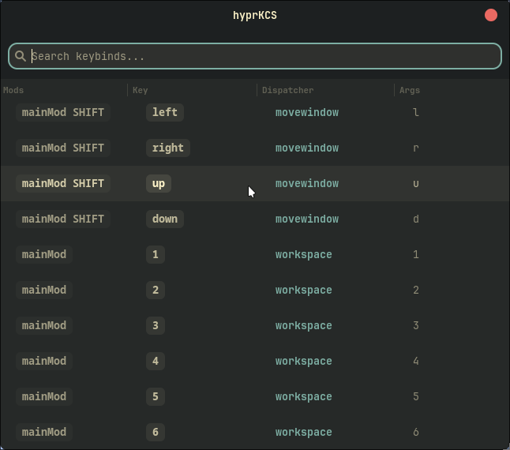

# hyprKCS

A fast, minimal Hyprland keybind cheat sheet written in Rust with GTK4 and Libadwaita.



## Features

- **Blazing Fast (lol):** Written in Rust.
- **Native Look:** Uses GTK4 and Libadwaita to match your system theme (supports Dark/Light mode and Matugen).
- **Interactive:** Search through your keybinds in real-time.
- **Editable:** Double-click any row to modify your keybinds directly from the UI. Changes are persisted to your `hyprland.conf`.

## Installation

### AUR (Arch Linux)
```bash
yay -S hyprkcs-git
```

### Nix
Run directly without installing:
```bash
nix run github:kosa12/hyprKCS
```

### Manual Build
Ensure you have `rust`, `cargo`, and `gtk4` development headers installed.
```bash
git clone https://github.com/kosa12/hyprKCS.git
cd hyprKCS
cargo build --release
```
The binary will be available at `./target/release/hyprKCS`.

## Configuration

To make the application open in floating mode by default, add the following to your `hyprland.conf`:

```ini
windowrulev2 = float, class:(com.github.hyprkcs|hyprKCS)
windowrulev2 = size 700 500, class:(com.github.hyprkcs|hyprKCS)
windowrulev2 = center, class:(com.github.hyprkcs|hyprKCS)
```

## Usage

- **Search:** Type in the top bar to filter keybinds by any field.
- **Edit:** Double-click a row to edit its modifiers, key, dispatcher, or arguments.
- **Close:** Press `Escape` or the window close button.

## Maintainer

**kosa12** (kosa03matyas@gmail.com)
- **PGP Fingerprint:** `D205 9131 FDE2 EECC 7C90 A549 F2CB 939C 8AA6 7892`

## License

MIT
