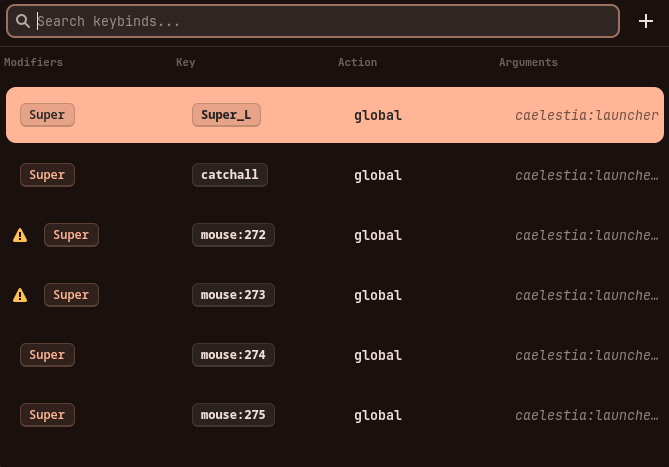
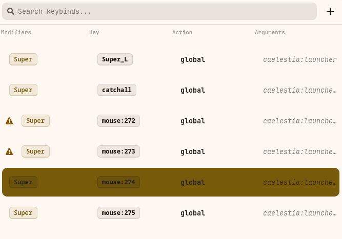
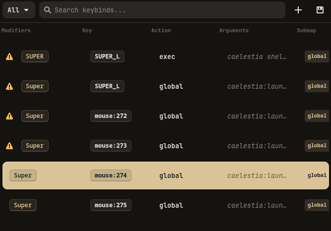

# hyprKCS

[](https://opensource.org/licenses/MIT)
[](https://aur.archlinux.org/packages/hyprkcs-git)
[](https://www.rust-lang.org/)

A fast, minimal Hyprland keybind cheat sheet written in Rust with GTK4 and Libadwaita.

<p align="center">
  
  
  
</p>

## Features

- **Blazing Fast (lol):** Written in Rust.
- **Native Look:** Uses GTK4 and Libadwaita to match your system theme (supports Dark/Light mode and Matugen).
- **Interactive Search:** Filter through your keybinds in real-time as you type.
- **Key Recorder:** Click "Record" and press a combination to automatically fill in modifiers and keys.
- **Conflict Detection:** Automatically highlights duplicate keybinds with a warning icon, resolving Hyprland variables (like `$mainMod`) for accuracy.
- **Sourced File Support:** Recursively parses files included via `source = ...`, allowing you to edit binds across your entire configuration.
- **Add, Edit & Delete:** Full CRUD support for your keybinds directly from the UI.
- **Toast Notifications:** Provides smooth, non-intrusive feedback for every action.
- **Safe Persistence:** Changes are written back to the correct configuration files automatically.

## Installation

### AUR (Arch Linux)
```bash
yay -S hyprkcs-git
```

### Nix
Run directly without installing:
```bash
nix run github:kosa12/hyprKCS
```

### Manual Build
Ensure you have `rust`, `cargo`, and `gtk4` development headers installed.
```bash
git clone https://github.com/kosa12/hyprKCS.git
cd hyprKCS
cargo build --release
```
The binary will be available at `./target/release/hyprKCS`.

## CLI Usage

hyprKCS provides a robust command-line interface for quick lookups and configuration management.

**Print all keybinds in a dynamic table:**
```bash
hyprKCS --print #or hyprKCS -p
```

**Filter keybinds by a search term:**
```bash
hyprKCS --search "firefox" #or hyprKCS -s "firefox"
```

**Use a custom configuration file:**
```bash
hyprKCS --config ~/.config/hypr/custom_binds.conf #or hyprKCS -c ~/.config/hypr/custom_binds.conf
```

**Show help:**
```bash
hyprKCS --help #or hyprKCS -h
```

**Show version:**
```bash
hyprKCS --version #or hyprKCS -V
```

## Troubleshooting

- **Keybinds not loading?**
hyprKCS looks for `~/.config/hypr/hyprland.conf` by default. If your config is elsewhere, use the `--config` flag.

- **Found a bug?**
Open an [Issue](https://github.com/kosa12/hyprKCS/issues).

## Maintainer:

**kosa12** (kosa03matyas@gmail.com)
- **PGP Fingerprint:** `D205 9131 FDE2 EECC 7C90 A549 F2CB 939C 8AA6 7892`

## License

MIT
